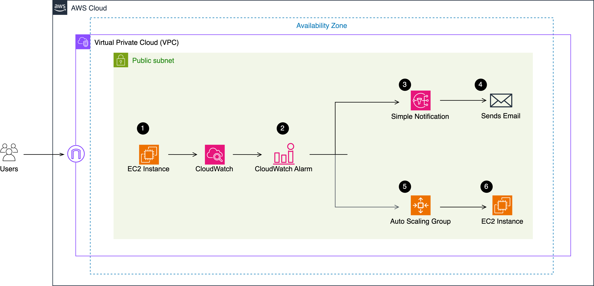

# ⚙️ Cloud Incident Simulation – Self-Healing AWS Infrastructure

[](https://aws.amazon.com/)
[](https://nodejs.org/)
[](https://ubuntu.com/)
[](https://aws.amazon.com/cloudwatch/)

## 📌 Objective

Simulate a real-world server failure scenario using AWS and build a self-healing system that automatically detects high CPU usage and recovers by launching a new EC2 instance — keeping the app live and resilient under stress.

## 🎯 Key Goals

- ✅ Simulate a CPU-overloaded EC2 instance
- ✅ Monitor server health using CloudWatch
- ✅ Send alerts using SNS
- ✅ Automatically recover using Auto Scaling Groups (ASG)
- ✅ Demonstrate real troubleshooting and infrastructure resiliency

## 🛠️ Technologies & Tools Used

- **AWS EC2** (Ubuntu-based instance)
- **Node.js + PM2** for process monitoring
- **AWS CloudWatch** (Metrics, Alarms)
- **AWS SNS** (Email alerts)
- **AWS IAM** (Role-based permissions)
- **AWS Auto Scaling Group (ASG)**
- **Bash scripting**
- **VPC, Subnet, Security Groups**

## 🧪 Incident 001 – High CPU Load on EC2 Instance

### 🔍 Incident Summary

Simulated a high-traffic event by stressing the CPU of a production-like EC2 instance using the stress tool. This triggered a CloudWatch alarm when CPU usage crossed 80%. An Auto Scaling Group responded by launching a new instance to maintain availability.

### 🧾 Steps Taken

1. Connected to EC2 via SSH
2. Verified CPU state using `top` and `ps aux`
3. Ran:
   ```bash
   stress --cpu 2 --timeout 500
   ```
4. CloudWatch Alarm triggered at 80% CPU threshold
5. SNS sent an alert via email
6. ASG launched a new instance from a custom AMI (with Node.js and PM2 pre-installed)
7. Verified that app was still live and stable

### ✅ Final Outcome

- New EC2 instance launched automatically
- Node.js app remained accessible
- Email notification confirmed incident trigger
- ASG+CloudWatch+SNS worked together seamlessly

## 🛡️ Preventive Measures Implemented

- Installed and configured PM2 to auto-restart the app
- Installed and configured the CloudWatch Agent
- Created custom AMI from configured instance for reliable launch template
- Attached IAM Roles for CloudWatch + recovery permissions
- Tested failure scenarios to validate end-to-end recovery

## 🧠 Skills Demonstrated

- **Infrastructure automation** (EC2 + ASG)
- **Observability** (CloudWatch Alarms, Metrics)
- **Server process monitoring** (PM2, Linux tools)
- **IAM security best practices**
- **Incident response workflow**
- **Hands-on debugging & resolution**

## 🧭 Architecture Overview

This architecture shows the system design for the self-healing infrastructure:

```
┌─────────────────┐    ┌─────────────────┐    ┌─────────────────┐
│   Auto Scaling  │    │   CloudWatch    │    │   SNS Topic     │
│      Group      │    │    Alarms       │    │   (Alerts)      │
└─────────────────┘    └─────────────────┘    └─────────────────┘
         │                       │                       │
         ▼                       ▼                       ▼
┌─────────────────┐    ┌─────────────────┐    ┌─────────────────┐
│   EC2 Instance  │    │   EC2 Instance  │    │                 │
│   (Primary)     │    │   (Recovery)    │    │                 │
│                 │    │                 │    │                 │
│  • Node.js App  │    │  • Node.js App  │    │  • Email        │
│  • PM2 Process  │    │  • PM2 Process  │    │  • SMS          │
│  • CloudWatch   │    │  • CloudWatch   │    │  • Webhook      │
│    Agent        │    │    Agent        │    │                 │
└─────────────────┘    └─────────────────┘    └─────────────────┘
```

---
Below you will find the architecture for the Self-Healing-App



---

**Built with ❤️ for resilient cloud infrastructure**

